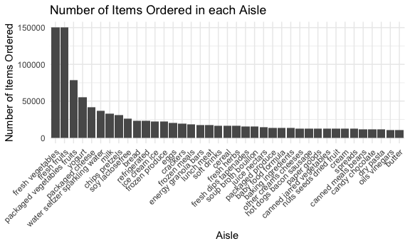

Homework 3
================
Thiago de Araujo - UNI tbd2117

``` r
library(tidyverse)

knitr::opts_chunk$set(
  fig.width = 6,
  fig.asp = .6,
  out.width = "90%"
)

theme_set(theme_minimal() + theme(legend.position = "bottom"))

options(
  ggplot2.continuous.color = "viridis",
  ggplot2.continuous.fill = "viridis"
)

scale_colour_discrete = scale_color_viridis_d
scale_fill_discrete = scale_fill_viridis_d
```

### Problem 1

Loading Intracart data.

``` r
library(p8105.datasets)
data("instacart")
```

The goal is to do some exploration of this dataset. To that end, write a
short description of the dataset, noting the size and structure of the
data, describing some key variables, and giving illstrative examples of
observations. Then, do or answer the following (commenting on the
results of each):

The *instacart* dataset constains data on products ordered through a
online grocery service that allows you to shop online from local stores.
Each row in the dataset is a product from an order (there is a single
order per user in this dataset). The dataset has 1384617 rows and 15
columns.

``` r
instacart %>% 
  group_by(product_id) %>% 
  summarize(
    n_obs = n(),
    n_unique = n_distinct(product_id)
  )
```

    ## `summarise()` ungrouping output (override with `.groups` argument)

    ## # A tibble: 39,123 x 3
    ##    product_id n_obs n_unique
    ##         <int> <int>    <int>
    ##  1          1    76        1
    ##  2          2     4        1
    ##  3          3     6        1
    ##  4          4    22        1
    ##  5          5     1        1
    ##  6          7     1        1
    ##  7          8    13        1
    ##  8          9     5        1
    ##  9         10   119        1
    ## 10         11     2        1
    ## # … with 39,113 more rows

**How many aisles are there, and which aisles are the most items ordered
from?**

``` r
aisle_df =
  instacart %>% 
    group_by(aisle) %>% 
    summarize(
      n_item = n()
    ) %>%
    arrange(desc(n_item))
```

    ## `summarise()` ungrouping output (override with `.groups` argument)

There are 134 aisles with most itens ordered from aisles fresh
vegetables, fresh fruits, packaged vegetables fruits, yogurt, packaged
cheese, water seltzer sparkling water.

**Make a plot that shows the number of items ordered in each aisle,
limiting this to aisles with more than 10000 items ordered. Arrange
aisles sensibly, and organize your plot so others can read it.**

``` r
aisle_df %>% 
  filter(n_item > 10000) %>%
  ggplot(aes(x = reorder(aisle, desc(n_item)), y = n_item)) + 
  geom_col() +
  theme(
    legend.position = "none",
    axis.text.x = element_text(angle=45, hjust = 1)
  ) + 
  labs(
    title = "Number of Items Ordered in each Aisle",
    x = "Aisle",
    y = "Number of Items Ordered"
  )
```



**Make a table showing the three most popular items in each of the
aisles “baking ingredients”, “dog food care”, and “packaged vegetables
fruits”. Include the number of times each item is ordered in your
table.**

``` r
instacart %>%
  filter(aisle %in% c("baking ingredients", "dog food care", "packaged vegetables fruits")) %>%
  select(aisle, product_name) %>%
  group_by(aisle, product_name) %>%
  summarise(
    n_item = n()
  ) %>%
  arrange(desc(n_item)) %>%
  slice(1:3) %>% 
  knitr::kable()
```

    ## `summarise()` regrouping output by 'aisle' (override with `.groups` argument)

| aisle                      | product\_name                                 | n\_item |
| :------------------------- | :-------------------------------------------- | ------: |
| baking ingredients         | Light Brown Sugar                             |     499 |
| baking ingredients         | Pure Baking Soda                              |     387 |
| baking ingredients         | Cane Sugar                                    |     336 |
| dog food care              | Snack Sticks Chicken & Rice Recipe Dog Treats |      30 |
| dog food care              | Organix Chicken & Brown Rice Recipe           |      28 |
| dog food care              | Small Dog Biscuits                            |      26 |
| packaged vegetables fruits | Organic Baby Spinach                          |    9784 |
| packaged vegetables fruits | Organic Raspberries                           |    5546 |
| packaged vegetables fruits | Organic Blueberries                           |    4966 |

**Make a table showing the mean hour of the day at which Pink Lady
Apples and Coffee Ice Cream are ordered on each day of the week; format
this table for human readers (i.e. produce a 2 x 7 table).**
