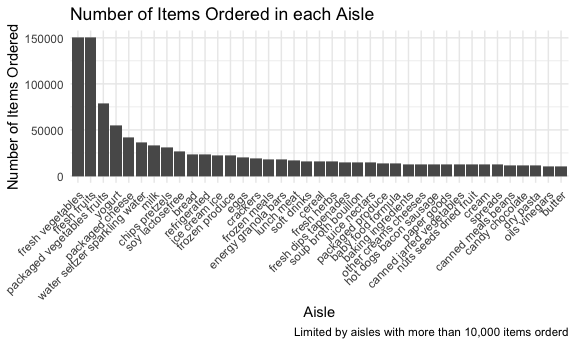

Homework 3
================
Thiago de Araujo - UNI tbd2117

``` r
library(tidyverse)

knitr::opts_chunk$set(
  fig.width = 6,
  fig.asp = .6,
  out.width = "90%"
)

theme_set(theme_minimal() + theme(legend.position = "bottom"))

options(
  ggplot2.continuous.color = "viridis",
  ggplot2.continuous.fill = "viridis"
)

scale_colour_discrete = scale_color_viridis_d
scale_fill_discrete = scale_fill_viridis_d
```

### Problem 1

Loading Intracart data.

``` r
library(p8105.datasets)
data("instacart")
```

**Write a short description of the dataset, noting the size and
structure of the data, describing some key variables, and giving
illstrative examples of observations.**

``` r
order_df=
instacart %>% 
  group_by(order_id) %>% 
  summarize(n_item = n())
```

The *instacart* dataset constains data on products ordered through a
online grocery service that allows you to shop online from local stores.
The dataset has 1384617 rows and 15 columns. Each row in the dataset is
a product from an order (there is a single order per user in this
dataset).  
It contains products from 131209 orders with an average 10.55 items per
order. Products are present in aisles within different departments.

**How many aisles are there, and which aisles are the most items ordered
from?**

``` r
aisle_df =
  instacart %>% 
    group_by(aisle) %>% 
    summarize(n_item = n()) %>%
    arrange(desc(n_item))
```

There are 134 aisles with most itens ordered from the following aisles:
fresh vegetables, fresh fruits, packaged vegetables fruits, yogurt,
packaged cheese, water seltzer sparkling water.

**Make a plot that shows the number of items ordered in each aisle,
limiting this to aisles with more than 10000 items ordered. Arrange
aisles sensibly, and organize your plot so others can read it.**

``` r
aisle_df %>% 
  filter(n_item > 10000) %>%
  ggplot(aes(x = reorder(aisle, desc(n_item)), y = n_item)) + 
  geom_col() +
  theme(
    legend.position = "none",
    axis.text.x = element_text(angle=45, hjust = 1)
  ) + 
  labs(
    title = "Number of Items Ordered in each Aisle",
    x = "Aisle",
    y = "Number of Items Ordered",
    caption = "Limited by aisles with more than 10,000 items orderd"
  )
```



**Make a table showing the three most popular items in each of the
aisles “baking ingredients”, “dog food care”, and “packaged vegetables
fruits”. Include the number of times each item is ordered in your
table.**

``` r
instacart %>%
  filter(aisle %in% c("baking ingredients", "dog food care", "packaged vegetables fruits")) %>%
  select(aisle, product_name) %>%
  group_by(aisle, product_name) %>%
  summarise(
    n_item = n()
  ) %>%
  arrange(desc(n_item)) %>%
  slice(1:3) %>% 
  mutate(aisle = str_to_title(aisle)) %>% 
  knitr::kable(
    col.names = c("Aisle", "Product Name", "Number of Times Ordered"), 
    align = "lcr"
  )
```

| Aisle                      |                 Product Name                  | Number of Times Ordered |
| :------------------------- | :-------------------------------------------: | ----------------------: |
| Baking Ingredients         |               Light Brown Sugar               |                     499 |
| Baking Ingredients         |               Pure Baking Soda                |                     387 |
| Baking Ingredients         |                  Cane Sugar                   |                     336 |
| Dog Food Care              | Snack Sticks Chicken & Rice Recipe Dog Treats |                      30 |
| Dog Food Care              |      Organix Chicken & Brown Rice Recipe      |                      28 |
| Dog Food Care              |              Small Dog Biscuits               |                      26 |
| Packaged Vegetables Fruits |             Organic Baby Spinach              |                    9784 |
| Packaged Vegetables Fruits |              Organic Raspberries              |                    5546 |
| Packaged Vegetables Fruits |              Organic Blueberries              |                    4966 |

**Make a table showing the mean hour of the day at which Pink Lady
Apples and Coffee Ice Cream are ordered on each day of the week; format
this table for human readers (i.e. produce a 2 x 7 table).**

``` r
instacart %>%
  filter(product_name %in% c("Pink Lady Apples", "Coffee Ice Cream")) %>%
  select(product_name, order_dow, order_hour_of_day) %>%
  group_by(product_name, order_dow) %>%
  summarise(
    mean_hour = mean(order_hour_of_day)
  ) %>%
  mutate(
    order_dow = case_when(
    order_dow == 0 ~ "Sunday",
    order_dow == 1 ~ "Monday",
    order_dow == 2 ~ "Tuesday",
    order_dow == 3 ~ "Wednesday",
    order_dow == 4 ~ "Thursday",
    order_dow == 5 ~ "Friday",
    order_dow == 6 ~ "Saturday",
    TRUE ~ "")
  ) %>%
  rename("Product Name" = product_name) %>% 
  pivot_wider(
    names_from = order_dow,
    values_from = mean_hour
  ) %>%
  knitr::kable()
```

| Product Name     |   Sunday |   Monday |  Tuesday | Wednesday | Thursday |   Friday | Saturday |
| :--------------- | -------: | -------: | -------: | --------: | -------: | -------: | -------: |
| Coffee Ice Cream | 13.77419 | 14.31579 | 15.38095 |  15.31818 | 15.21739 | 12.26316 | 13.83333 |
| Pink Lady Apples | 13.44118 | 11.36000 | 11.70213 |  14.25000 | 11.55172 | 12.78431 | 11.93750 |

### Problem 2

**Load, tidy, and otherwise wrangle the data. Your final dataset should
include all originally observed variables and values; have useful
variable names; include a weekday vs weekend variable; and encode data
with reasonable variable classes. Describe the resulting dataset
(e.g. what variables exist, how many observations, etc).**

``` r
accel_df = 
  read_csv("./data/accel_data.csv") %>% 
  janitor::clean_names() %>%
  group_by(week) %>%
  pivot_longer(
    cols = activity_1:activity_1440,
    names_to = "minute",
    names_prefix = "activity_",
    values_to = "activity"
  ) %>%
  mutate(
    day = factor(day),
    day = forcats::fct_relevel(day, c("Monday", "Tuesday", "Wednesday", "Thursday", "Friday", "Saturday", "Sunday")),
    weekend = factor(case_when(
      day == "Saturday" ~ "Weekend",
      day == "Sunday" ~ "Weekend",
      TRUE ~ "Weekday"
    )),
    minute = as.numeric(minute)
  ) %>% 
  select(week, day, weekend, day_id, minute, activity)
```

    ## Parsed with column specification:
    ## cols(
    ##   .default = col_double(),
    ##   day = col_character()
    ## )

    ## See spec(...) for full column specifications.

The *accel\_df* dataset contains data on accelerometer activity
collected on a 63 year-old male with BMI 25. Each row in the dataset is
the activity in one minute in a day within a week. The dataset has 50400
rows and 6 columns.

**Traditional analyses of accelerometer data focus on the total activity
over the day. Using your tidied dataset, aggregate accross minutes to
create a total activity variable for each day, and create a table
showing these totals. Are any trends apparent?**

``` r
accel_df %>% 
  group_by(week, day) %>% 
  summarise(
    activity_day = sum(activity)
  ) %>% 
  knitr::kable()
```

    ## `summarise()` regrouping output by 'week' (override with `.groups` argument)

| week | day       | activity\_day |
| ---: | :-------- | ------------: |
|    1 | Monday    |      78828.07 |
|    1 | Tuesday   |     307094.24 |
|    1 | Wednesday |     340115.01 |
|    1 | Thursday  |     355923.64 |
|    1 | Friday    |     480542.62 |
|    1 | Saturday  |     376254.00 |
|    1 | Sunday    |     631105.00 |
|    2 | Monday    |     295431.00 |
|    2 | Tuesday   |     423245.00 |
|    2 | Wednesday |     440962.00 |
|    2 | Thursday  |     474048.00 |
|    2 | Friday    |     568839.00 |
|    2 | Saturday  |     607175.00 |
|    2 | Sunday    |     422018.00 |
|    3 | Monday    |     685910.00 |
|    3 | Tuesday   |     381507.00 |
|    3 | Wednesday |     468869.00 |
|    3 | Thursday  |     371230.00 |
|    3 | Friday    |     467420.00 |
|    3 | Saturday  |     382928.00 |
|    3 | Sunday    |     467052.00 |
|    4 | Monday    |     409450.00 |
|    4 | Tuesday   |     319568.00 |
|    4 | Wednesday |     434460.00 |
|    4 | Thursday  |     340291.00 |
|    4 | Friday    |     154049.00 |
|    4 | Saturday  |       1440.00 |
|    4 | Sunday    |     260617.00 |
|    5 | Monday    |     389080.00 |
|    5 | Tuesday   |     367824.00 |
|    5 | Wednesday |     445366.00 |
|    5 | Thursday  |     549658.00 |
|    5 | Friday    |     620860.00 |
|    5 | Saturday  |       1440.00 |
|    5 | Sunday    |     138421.00 |

In the first two weeks, he was less active on mondays and progressivly
increased his activity until friday. He tended to be fairly active
during weekends, except for the last two weeks - he probably did not use
his accelerometer on the last two saturdays.

**Accelerometer data allows the inspection activity over the course of
the day. Make a single-panel plot that shows the 24-hour activity time
courses for each day and use color to indicate day of the week. Describe
in words any patterns or conclusions you can make based on this graph.**

``` r
accel_df %>% 
  ggplot(aes(x = minute, y = activity, color = day))+
  geom_line() + 
  labs(
    title = "Activity of Mr. X",
    x = "Minute of the Day",
    y = "Activity",
      caption = "63 year-old, male, BMI 25"
  ) + 
  scale_x_continuous(
    limits = c(0, 1440),
    breaks = c(0, 360, 720, 1080, 1440),
    labels = c("00:00", "06:00", "12:00", "18:00", "00:00")
  )
```


He starts his activities around 5h and diminishes it around 22h. On
sundays, the patient is more active around noon while during other days
of the week he is more active at night. There is somewhat of a peak in
activity around 17-18h on weekends apparently.

### Problem 3
